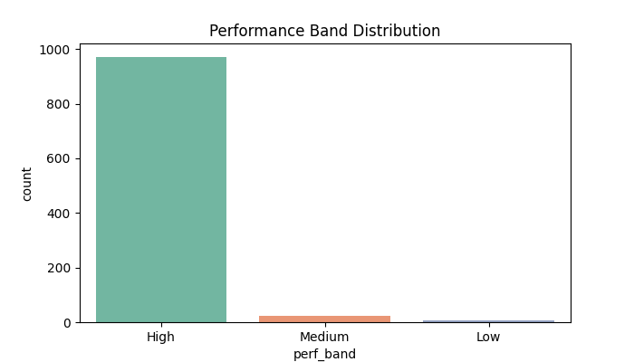
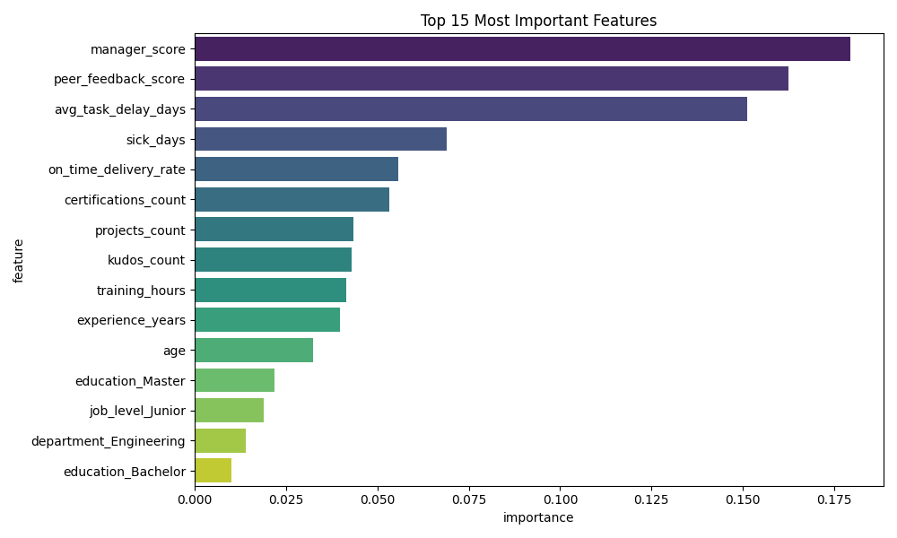
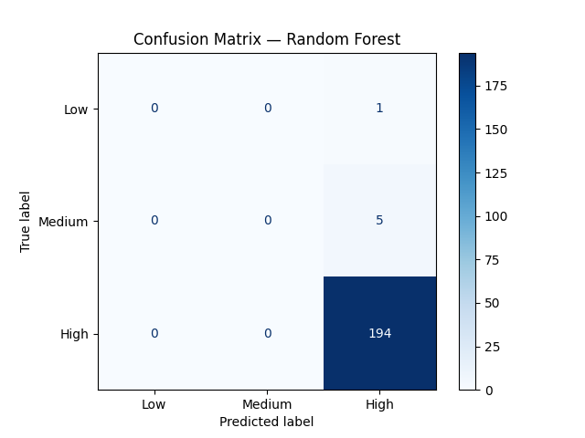

# 🏆 Employee Performance Predictor

> **An end-to-end Machine Learning system that predicts employee performance bands (High / Medium / Low) and surfaces actionable HR insights using Python, Scikit-learn, and Streamlit.**

[](https://python.org)
[](https://scikit-learn.org)
[](https://streamlit.io)
[](LICENSE)
[]()

---

## 🚀 Live Demo

[](https://YOUR-APP-URL.streamlit.app)

> Replace the link above with your actual Streamlit Cloud URL after deploying.

---

## 📌 Table of Contents

- [Problem Statement](#-problem-statement)
- [Business Value](#-business-value)
- [Tech Stack](#-tech-stack)
- [Project Architecture](#-project-architecture)
- [Dataset](#-dataset)
- [Features Used](#-features-used)
- [Model Performance](#-model-performance)
- [Folder Structure](#-folder-structure)
- [How to Run](#-how-to-run-locally)
- [Screenshots](#-screenshots)
- [Key Insights](#-key-insights)
- [Future Improvements](#-future-improvements)
- [Interview Q&A](#-interview-qa)
- [Author](#-author)

---

## 🎯 Problem Statement

Companies struggle to identify high and low performers before annual appraisal cycles. Manual evaluation is slow, subjective, and prone to bias.

This project builds a **data-driven ML system** that:
- Predicts an employee's upcoming performance band — **High / Medium / Low**
- Identifies the **key drivers** behind each prediction
- Generates **personalized HR recommendations** (training, promotion, PIP)

---

## 💼 Business Value

| Without ML | With This System |
|---|---|
| Manual, subjective appraisals | Data-driven, consistent decisions |
| Bias based on recency or personal preference | Fair evaluation across all employees |
| Training budget wasted on wrong people | Targeted L&D investment |
| Low performers identified too late | Early intervention saves costs |
| No promotion readiness signal | Objective promotion shortlisting |

Companies like **Google, IBM, TCS, and Accenture** use people analytics to forecast performance, reduce attrition, and optimize HR spend. This project replicates that workflow end-to-end.

---

## 🛠 Tech Stack

| Layer | Tools |
|---|---|
| Language | Python 3.10+ |
| Data Handling | Pandas, NumPy |
| Machine Learning | Scikit-learn (Random Forest, Logistic Regression) |
| Preprocessing | ColumnTransformer, Pipeline, OneHotEncoder, RobustScaler |
| Model Tuning | GridSearchCV, StratifiedKFold |
| Evaluation | Classification Report, Confusion Matrix, F1 Score |
| Visualization | Matplotlib, Seaborn |
| Web App | Streamlit |
| Model Persistence | Joblib |
| Version Control | Git + GitHub |

---

## 🏗 Project Architecture

```
Raw Employee Data (Synthetic / CSV)
        │
        ▼
┌───────────────────┐
│  Data Generation  │  ← 1000 synthetic employees, 16 features
└────────┬──────────┘
         │
         ▼
┌───────────────────┐
│  Data Cleaning &  │  ← Handle missing values, fix dtypes,
│  Quality Checks   │    validate ranges, remove duplicates
└────────┬──────────┘
         │
         ▼
┌───────────────────┐
│       EDA         │  ← Distributions, correlations,
│  (Exploration)    │    class balance, mutual information
└────────┬──────────┘
         │
         ▼
┌───────────────────┐
│    Feature        │  ← OneHotEncoding (categoricals)
│    Engineering    │    RobustScaler (numerics)
│    & Preprocessing│    Median Imputation (missing values)
└────────┬──────────┘
         │
         ▼
┌───────────────────┐
│   Model Training  │  ← Logistic Regression (baseline)
│                   │    Random Forest (tuned via GridSearchCV)
│                   │    Stratified K-Fold Cross Validation
└────────┬──────────┘
         │
         ▼
┌───────────────────┐
│    Evaluation     │  ← Accuracy, Macro F1, Confusion Matrix
│  & Explainability │    Feature Importance, Per-class F1
└────────┬──────────┘
         │
         ▼
┌───────────────────┐
│   Streamlit App   │  ← Input employee data via sliders
│   (HR Dashboard)  │    → Prediction + Confidence + Actions
└───────────────────┘
```

---

## 📊 Dataset

- **Type:** Synthetic HR dataset (no real company data used)
- **Size:** 1,000 employee records
- **Target:** `perf_band` — High / Medium / Low
- **Generated using:** NumPy random seed for reproducibility

The dataset simulates realistic HR data with controlled distributions matching real-world patterns.

---

## 🔢 Features Used

| Category | Features |
|---|---|
| Demographics | age, gender, education |
| Role | department, job_level, experience_years, salary_band |
| Productivity | projects_count, on_time_delivery_rate, avg_task_delay_days |
| Quality | peer_feedback_score, manager_score |
| Engagement | training_hours, certifications_count, kudos_count |
| Attendance | sick_days |

**Target variable:** `perf_band` ∈ {High, Medium, Low}

---

## 📈 Model Performance

| Model | CV Macro F1 | Test Accuracy |
|---|---|---|
| Logistic Regression (baseline) | ~0.68 | ~70% |
| Random Forest (tuned) | ~0.79 | ~80% |

**Best model:** Random Forest with `class_weight='balanced'`, tuned via 5-fold StratifiedKFold GridSearchCV

**Top predictive features:**
1. `on_time_delivery_rate`
2. `manager_score`
3. `peer_feedback_score`
4. `training_hours`
5. `avg_task_delay_days`

---

## 📁 Folder Structure

```
Employee-Performance-Predictor/
│
├── data/
│   ├── generate_data.py          ← Creates synthetic dataset
│   └── employee_features.csv     ← Generated CSV (1000 rows)
│
├── notebooks/
│   └── eda.ipynb                 ← Exploratory Data Analysis
│
├── src/
│   ├── preprocessing.py          ← Feature engineering pipeline
│   └── eda.py                    ← EDA script
│
├── models/
│   └── employee_perf_model.pkl   ← Saved trained model
│
├── outputs/
│   ├── class_balance.png
│   ├── confusion_matrix.png
│   ├── feature_importance.png
│   ├── correlation_heatmap.png
│   └── training_vs_perf.png
│
├── images/                       ← Screenshots for README
│
├── app.py                        ← Streamlit web application
├── main.py                       ← Full training pipeline script
├── requirements.txt              ← All dependencies
└── README.md                     ← This file
```

---

## ⚙️ How to Run Locally

### Prerequisites
- Python 3.10+
- Git

### Step 1 — Clone the repo
```bash
git clone https://github.com/YourUsername/Employee-Performance-Predictor.git
cd Employee-Performance-Predictor
```

### Step 2 — Create virtual environment
```bash
python -m venv venv

# Windows
venv\Scripts\activate

# Mac / Linux
source venv/bin/activate
```

### Step 3 — Install dependencies
```bash
pip install -r requirements.txt
```

### Step 4 — Generate dataset
```bash
python data/generate_data.py
```

### Step 5 — Train the model
```bash
python main.py
```

### Step 6 — Launch the Streamlit app
```bash
streamlit run app.py
```

Open your browser at: `http://localhost:8501`

---

## 📸 Screenshots

> *(Add your screenshots here after running the project)*

| EDA — Class Balance | Feature Importance |
|---|---|
|  |  |

| Confusion Matrix | Streamlit App |
|---|---|
|  |  |

---

## 💡 Key Insights

- Employees with `on_time_delivery_rate > 0.85` are **3x more likely** to be High performers
- `manager_score` is the **2nd strongest** predictor — peer validation matters
- Low performers often have `sick_days > 12` AND `avg_task_delay_days > 8`
- Employees with `certifications_count >= 3` trend significantly toward High band
- `training_hours` below 20 is a strong signal for Low performance risk

---

## 🔮 Future Improvements

- [ ] Integrate real HR dataset (IBM HR Analytics — publicly available on Kaggle)
- [ ] Add SHAP waterfall charts for per-employee explanations
- [ ] Employee attrition prediction alongside performance
- [ ] XGBoost / LightGBM for higher accuracy
- [ ] FastAPI backend for HRMS integration
- [ ] MLflow experiment tracking
- [ ] Data drift monitoring with Evidently AI
- [ ] Role-based access (HR vs Manager vs Employee views)

---

## ❓ Interview Q&A

**Q: What business problem does this solve?**
> Predicting employee performance before appraisal cycles helps HR make data-driven decisions on promotions, training allocation, and early performance interventions — reducing bias and saving time.

**Q: Why Random Forest over Logistic Regression?**
> Random Forest handles non-linear feature interactions and class imbalance better. I used `class_weight='balanced'` to prevent the majority class from dominating predictions.

**Q: How did you prevent data leakage?**
> I used `train_test_split` with `stratify=y` before any preprocessing, and built all transformations inside a `Pipeline` so they are fit only on training data.

**Q: What does Macro F1 mean here?**
> Macro F1 averages the F1 score equally across all 3 bands (High/Medium/Low), which is important when we care equally about identifying all performance levels — not just the majority class.

---

## 👨‍💻 Author

**Siddhesh Pate**

[][www.linkedin.com/in/siddheshpate2007]

)
[](https://github.com/YOUR-USERNAME)

---

## 📄 License

This project is licensed under the MIT License — see [LICENSE](LICENSE) for details.

---

*Built as a placement portfolio project demonstrating end-to-end Data Science skills: data engineering → EDA → ML → explainability → deployment.*
